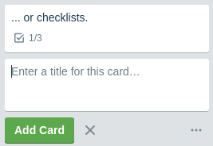
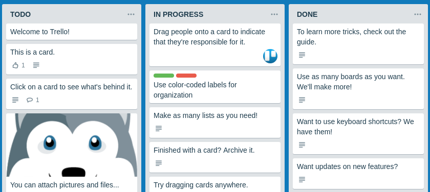

Working with files, DnD

Rules for submitting assignments:

1. **Important**: Yarn must be used as part of this PD (therefore, the `package-lock.json` file should not be in the repository)
2. Everything should be collected via Webpack (including images and styles) and laid out on Github Pages via Appveyor
3. README.md should contain build badge and link to Github Pages
4. As a result, send the reviewer links to your GitHub projects
5. Auto-tests do not need to be written

---

### Trello

#### Legend

You are building an internal task management system and your management really likes the approach used in [Trello](https://trello.com):

#### Description

In fact, you have a board consisting of columns, in each column there can be several cards.

To simplify, we make the following assumptions:
1. The number of columns is fixed and equal to 3
1. You can't add new columns, you can't delete existing ones either
3. You can't move columns either

What is possible:
1. Add cards using the 'Add another card' button. This is how it looks like:

2. Delete cards - when you hover over a card, a cross icon ("\E951") appears, which deletes the card (note that there is no such operation in the original Trello, there is only archiving, but we introduced it to simplify it):

 
4. Move cards both within a column and between columns:

##### Moving process

1. Appearance before transfer (the card is in its place):

2. Appearance at the time of transfer (the card is removed from its initial position):

Pay attention to the following nuances:
1. Cursor appearance ('grabbing')
2. The cursor in relation to the card remains where it was originally grabbed - it is not attached to either the left edge or the center, but where the card was grabbed, i.e. you can grab the bottom left corner:

3. When hovering over other positions, a place is allocated under the card in height equal to the size of the card itself, while the card will be placed "before" or "after" the element is determined solely by the position of the cursor:

##### Optional

Additional requirements:
1. Store all state in LocalStorage so that after refreshing the page, the changes made are saved
1. Build the DOM tree based on the state stored in LocalStorage

##### Simplifications

To simplify, just do:
1. Ability to store text (pictures, lists, color design of elements is not necessary)
2. Moving the card itself (no need to rotate)
3. You can also not handle the situation associated with the removal of the element from the board